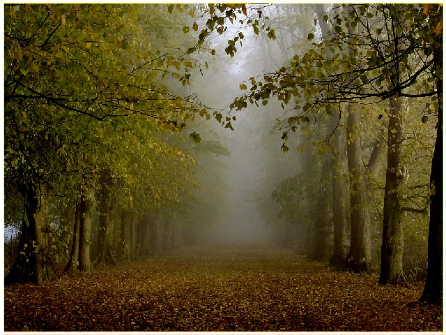
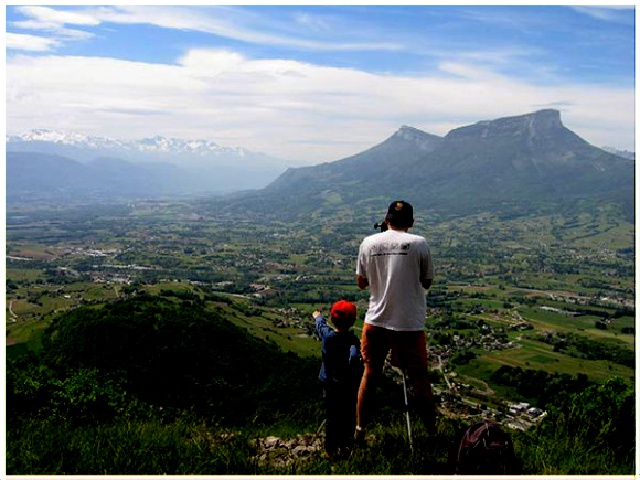
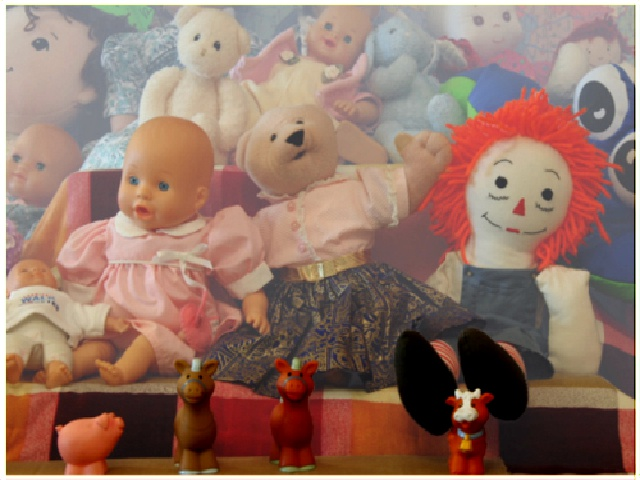
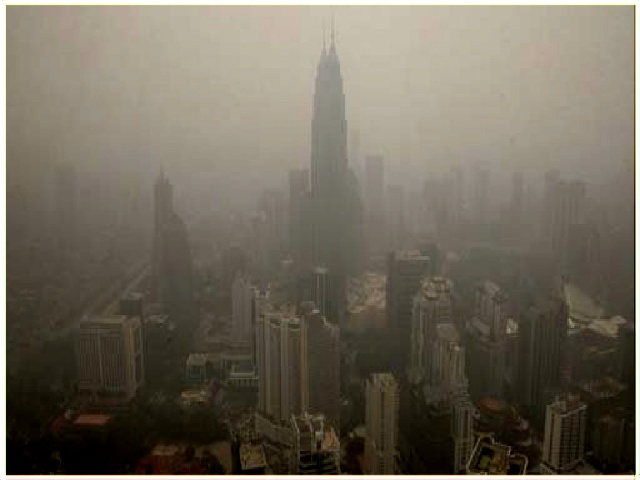
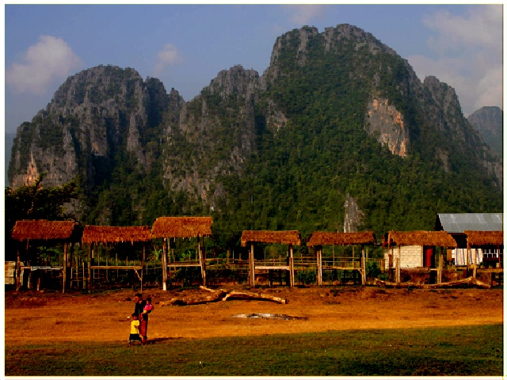
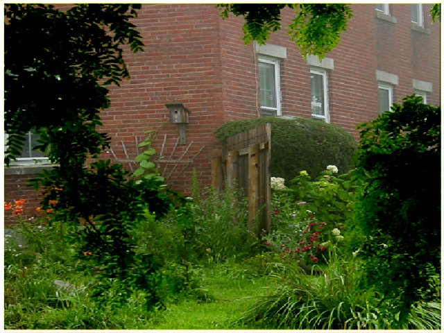

# All-In-One-Image-Dehazing-Tensorflow

Tensorflow implementation of an extremely light weight All In One Image Dehazing (AOD) network as described <a href="https://sites.google.com/site/boyilics/website-builder/project-page">here</a>

An explanation and walk-through is provided <a href="https://medium.com/@tusharsircar95/all-in-one-image-dehazing-aod-paper-explanation-tensorflow-implementation-bb97f6a6f1ef">here</a>.

## Training & Validation

<ul>
  <li>Data has been downloaded from <a href="https://sites.google.com/site/boyilics/website-builder/project-page">here</a>. This includes ~1500 images from the NYU2 dataset and ~27K synthetically hazed images</li>
  <li> Image size was set to 480x640 and were normalized to [0,1] </li>
  <li>90% of the data was kept for training and the rest 10% for validation</li>
  <li> Adam optimizer with learning rate of 0.0001 was used. Gradient norm was clipped at 0.1.</li>
  <li> Weights were initialized with a Gaussian distribution (Mean 0.0, STD 0.02) and a weight decay of 0.0001 was used.</li>
  <li> 8 epoch were run, although significant improvement was not observed after 3 epochs.</li>
  <li> Loss function was MSE. Train MSE and Validation MSE were about ~ 0.015
</ul>

## Evaluation

<ul>
  <li>Model checkpoint files have been included in the <b>models</b> folder</li>
  <li> To evaluate, add .jpeg or .jpg images in the <b>test_images</b> folder and run the <b>Evaluation</b> section in the Python notebook.</li>
  <li> Dehazed images are saved to the <b>dehazed_test_images</b> folder
</ul>

## Results

<table align='center'>
  <tr align='center'>
    <td width='400px'> Original Hazy Image </td>
    <td width='400px'> Dehazed Image </td>
  </tr>
  <tr>
    <td></td>
    <td></td>
  </tr>
  <tr>
    <td></td>
    <td></td>
  </tr>
  <tr>
    <td></td>
    <td></td>
  </tr>
  <tr>
    <td></td>
    <td></td>
  </tr>
  <tr>
    <td></td>
    <td></td>
  </tr>
  <tr>
    <td></td>
    <td></td>
  </tr>
  <tr>
    <td></td>
    <td></td>
  </tr>
</table>

### References

```
@InProceedings{Li_2017_ICCV,
author = {Li, Boyi and Peng, Xiulian and Wang, Zhangyang and Xu, Jizheng and Feng, Dan},
title = {AOD-Net: All-In-One Dehazing Network},
booktitle = {The IEEE International Conference on Computer Vision (ICCV)},
month = {Oct},
year = {2017}
}
```

<a href="https://github.com/TheFairBear/PyTorch-Image-Dehazing">https://github.com/TheFairBear/PyTorch-Image-Dehazing</a> -  PyTorch Implementation
